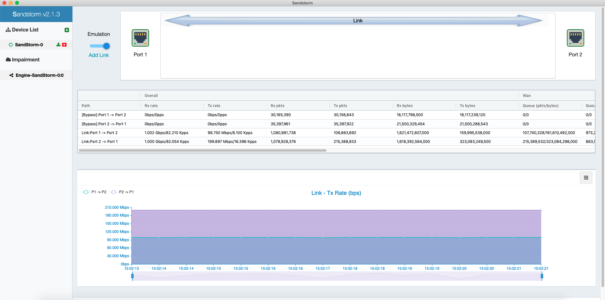

### Introduction

MiniSMB SandStorm is a WAN environment emulator for network application developers, system administrators and network engineers. Software developers creating Internet applications, especially for latency/jitter sensitive, loss sensitive ones like audio/video chat, remote file access protocols, need to thoroughly test their products in a range of environments. Most applications work well on broadband connections, but what if your application will also be used on low-speed communication links such as GPRS or Satellite?

This is where Sandstorm WAN Emuator comes in handy. It imitates a network connection with low bandwidth limits, latency and losses. With Sandstorm you can test how well your application performs on slow or long-distance connections to ensure the quality of your software product. Sandstorm runs on any Intel based PC with intel NIC cards, allowing you to selectively apply bandwidth limits, introduce random or fixed delays on data flows, and simulate packet loss to mimic a low-grade communication channel.

Sandstorm WAN Emuator actually is based on Intel DPDK library, so it pursues high performance, high precise, High bandwdith. 



### How to Install
MiniSMB provides a single IMG file, you could download it and burn it into your USB stick (the minimal USB stick size 4GB). change your PC BIOS to select USB as first boot device, boot up your x86 PC/Server then you will see the initial setup dialogue. 

### Free edition vs Paid User
```
+-------------+-----------+------------------------------------+-----------------------------+
|             | Free      | Experience                         | Premium                     |
+-------------+-----------+------------------------------------+-----------------------------+
| 1Gbps Link  |  30Kpps   |  250Kpps/1Gbps $50 USD / year      | no limit / $1000 USD / year |
+-------------+-----------+------------------------------------+-----------------------------+
| 10Gbps Link |  100kpps  |  2Mpps/10Gbps  $100 USD / year     | no limit / $2500 USD / year |
+-------------+-----------+------------------------------------+-----------------------------+
```
* free support one wan emulator engine

### Contact
If you have any questions, please send email to tony.cai@minismb.com
